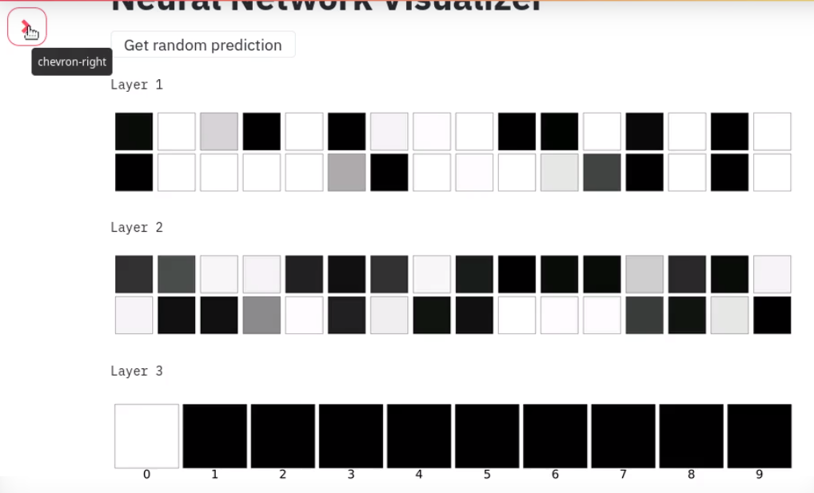

# MNIST NEURAL NETWORK VISUALIZER
A Visualizer to visualize the output of each layer in 
a neural network which is trained over MNIST dataset to recognize
hand written digits.

# Contribution 
Feel free to add your model and tune the output layers as you wish! 
For any more improvements, feel free to add a Pull Request or open a issue.